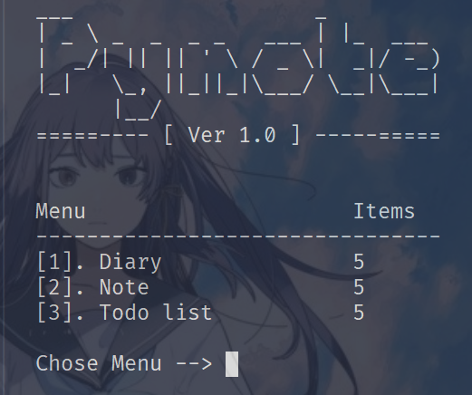

# My Personal CLI Application for Writing Notes

This is a command-line interface (CLI) application designed to help you write and manage your notes effectively.

## Screenshoot


![Screenshot 2](./screenshoot/2.png

## How to Run

Follow the steps below to run the application:

1. Download the source code.
2. Unzip the downloaded file.
3. Open the command-line interface or terminal.
4. Navigate to the directory where the source code is located.
5. copy the data from `data.example.json` and paste to `data.json` file
6. Run the `main.py` file.

```bash
$ python main.py
```

## Usage

The application supports the following options:

- `-h, --help`: Show the help message and exit.
- `-r READ, --read READ`: Read an item.
- `-c CREATE, --create CREATE`: Create an item.
- `-u UPDATE, --update UPDATE`: Update an item with the specified ID.
- `-d DELETE, --delete DELETE`: Delete an item with the specified ID.
- `-s SEARCH, --search SEARCH`: Search for an item using a keyword. Note: The input must be of string type.
- `-p PAGE, --page PAGE`: Choose a page.

For the Todo-list feature, the following options are available:

- `-f ISFALSE, --isFalse ISFALSE`: Set the status of an item to false.
- `-t ISTRUE, --isTrue ISTRUE`: Set the status of an item to true.
- `-l LIST, --list LIST`: List all todos based on their status. Use `1` for true and `0` for false.

# Example

Create Item: You can create a new item for your notes using the `-c` or `--create` option. For example:
```
$ python main.py --create 1
```


# License

This project is licensed under the [MIT License](LICENSE).

```
MIT License

Permission is hereby granted, free of charge, to any person obtaining a copy of this software and associated documentation files (the "Software"), to deal in the Software without restriction, including without limitation the rights to use, copy, modify, merge, publish, distribute, sublicense, and/or sell copies of the Software, and to permit persons to whom the Software is furnished to do so, subject to the following conditions:

The above copyright notice and this permission notice shall be included in all copies or substantial portions of the Software.

THE SOFTWARE IS PROVIDED "AS IS", WITHOUT WARRANTY OF ANY KIND, EXPRESS OR IMPLIED, INCLUDING BUT NOT LIMITED TO THE WARRANTIES OF MERCHANTABILITY, FITNESS FOR A PARTICULAR PURPOSE AND NONINFRINGEMENT. IN NO EVENT SHALL THE AUTHORS OR COPYRIGHT HOLDERS BE LIABLE FOR ANY CLAIM, DAMAGES OR OTHER LIABILITY, WHETHER IN AN ACTION OF CONTRACT, TORT OR OTHERWISE, ARISING FROM, OUT OF OR IN CONNECTION WITH THE SOFTWARE OR THE USE OR OTHER DEALINGS IN THE SOFTWARE.
```
